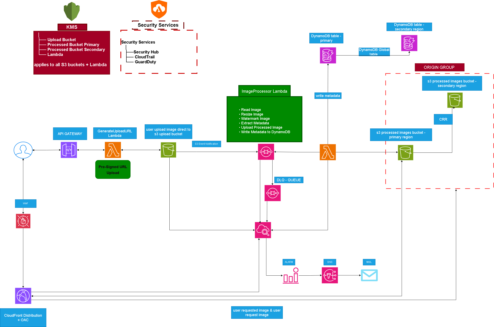
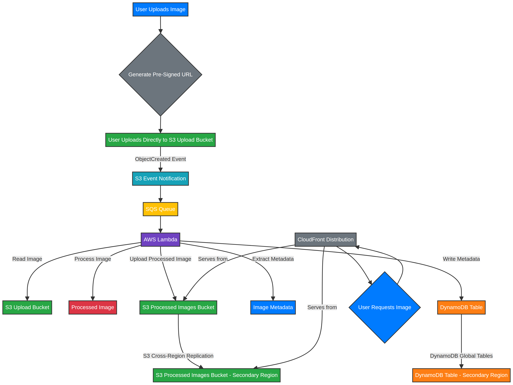
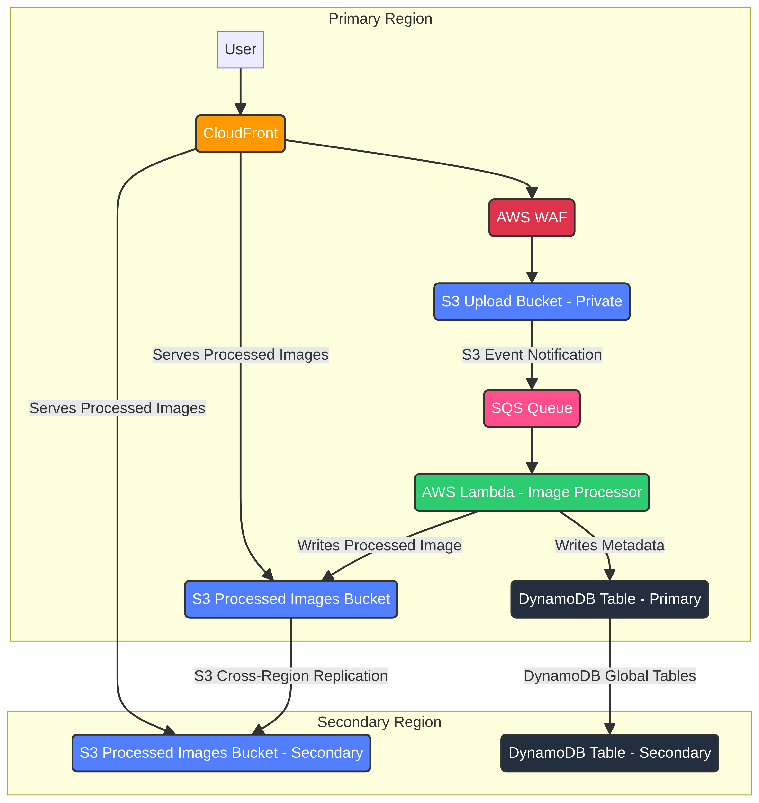
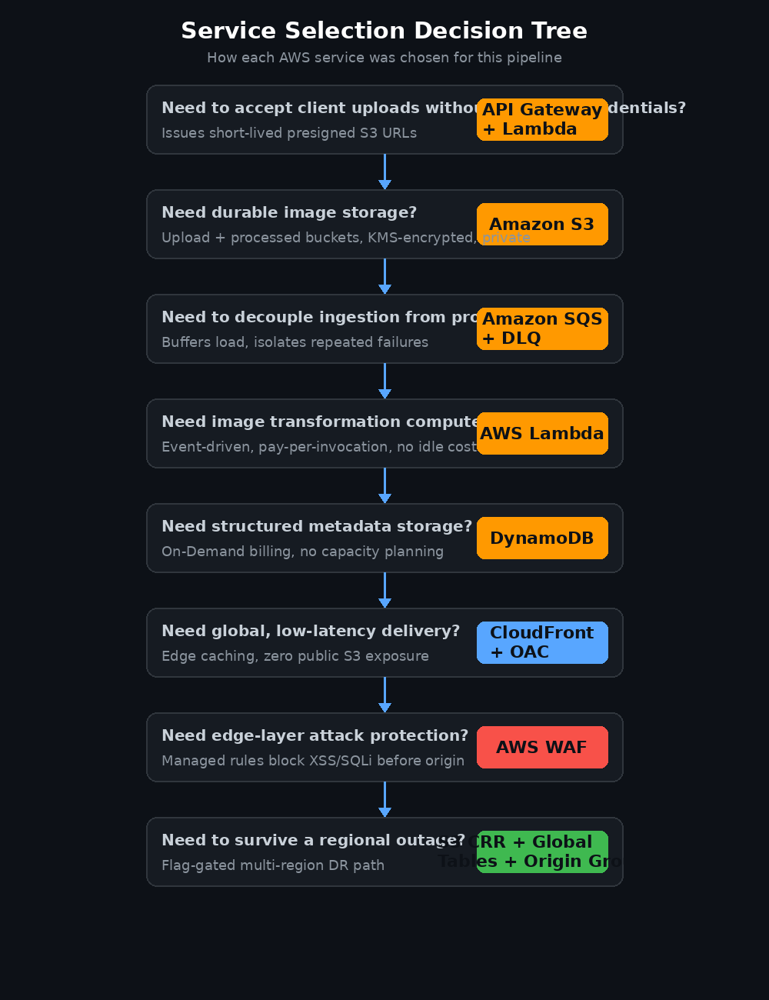
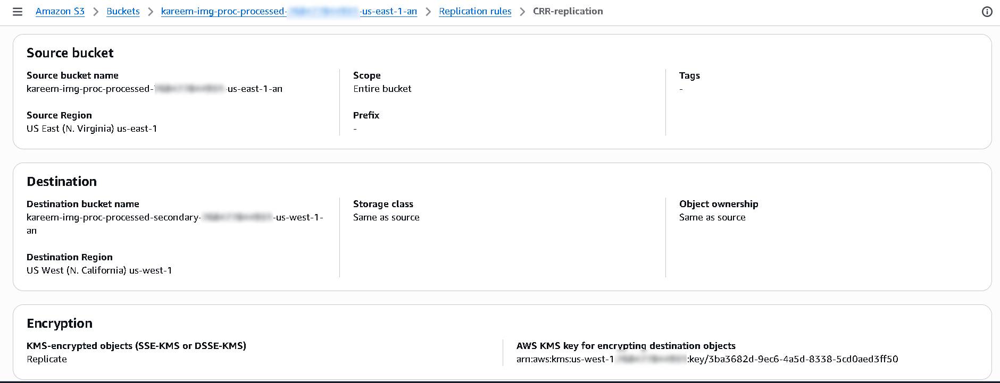

# Global Secure Image Processing Pipeline on AWS

<div align="center">

[](https://aws.amazon.com/architecture/well-architected/)
[](./docs/threat-model.md)
[](./docs/disaster-recovery.md)
[](./LICENSE)

**A production-style, security-first, serverless image processing platform engineered against the AWS Well-Architected Framework — least-privilege IAM, defense-in-depth, event-driven scaling, and multi-region disaster recovery.**

</div>

---

## Features

✅ **Serverless Architecture**  
✅ **Secure by Design** (Least Privilege + OAC + CMK)  
✅ **Event-Driven Processing** (SQS + DLQ)  
✅ **Global Private Delivery** (CloudFront + OAC)  
✅ **Multi-Region Disaster Recovery** (feature-flagged)  
✅ **Comprehensive Monitoring** (CloudWatch + GuardDuty + Security Hub)  
✅ **Well-Architected Alignment**  
✅ **Defense-in-Depth Security**

---

## 🚀 Quick Navigation

### Overview
- [Executive Summary](#executive-summary)
- [Architecture](#architecture)
- [Monitoring](#monitoring)

### Architecture & Design
- [Architecture Decisions](./docs/architecture-decisions.md)
- [Assumptions & Limitations](./docs/assumptions-and-limitations.md)

### Security
- [Threat Model](./docs/threat-model.md)
- [Security Review](./docs/security-review.md)
- [Least Privilege Review](./docs/least-privilege-review.md)
- [Security Control Matrix](./docs/security-control-matrix.md)
- [Risk Register](./docs/risk-register.md)

### Operations & Governance
- [Well-Architected Review](./docs/well-architected.md)
- [Monitoring Guide](./docs/monitoring.md)
- [Disaster Recovery](./docs/disaster-recovery.md)
- [Deployment Guide](./docs/deployment-guide.md)

### Validation & Analysis
- [Testing Results](./docs/testing-results.md)
- [Cost Analysis](./docs/cost-analysis.md)
- [Lessons Learned](./docs/lessons-learned.md)

### Release Documentation
- [Release Notes v1.0.0](./docs/release-notes-v1.0.0.md)

---

## Project Status

| Area                  | Status     |
|-----------------------|------------|
| Architecture          | Complete   |
| Security Controls     | Complete   |
| Monitoring            | Complete   |
| Disaster Recovery     | Complete   |
| Documentation         | Complete   |
| CI/CD Pipeline        | Future Enhancement    |

---

## Project Overview

This project demonstrates how to build a secure and scalable image processing solution using AWS serverless services. Images are uploaded to Amazon S3 using presigned URLs, processed automatically through an event-driven workflow, stored securely, and distributed globally through Amazon CloudFront.

---

## Project Highlights

- Secure direct-to-S3 uploads using presigned URLs
- Event-driven image processing with SQS buffering
- Defense-in-depth security architecture
- Private content delivery through CloudFront OAC
- End-to-end encryption using AWS KMS
- Multi-region disaster recovery design
- Comprehensive monitoring and audit logging

---

## Architecture Diagrams

### Solution Architecture


### End-to-End Processing Flow


### Multi-Region Disaster Recovery


### Service Selection Decision Tree


## Architecture Components

| Service              | Purpose                          |
|----------------------|----------------------------------|
| API Gateway (HTTP)   | Public upload URL API            |
| AWS Lambda           | Presigned URL + Image Processing |
| Amazon S3            | Raw & Processed Object Storage   |
| Amazon SQS + DLQ     | Decoupling & Reliable Processing |
| Amazon DynamoDB      | Metadata & Status Storage        |
| Amazon CloudFront    | Global Secure Delivery (OAC)     |
| AWS WAF              | Edge Protection                  |
| AWS KMS (CMK)        | Encryption at Rest               |
| Amazon SNS           | Alerting                         |
| Amazon CloudWatch    | Monitoring & Alarms              |

---

## Technologies Used

- Amazon API Gateway
- AWS Lambda
- Amazon S3
- Amazon SQS
- Amazon DynamoDB
- Amazon CloudFront
- AWS WAF
- AWS KMS
- Amazon SNS
- Amazon CloudWatch
- AWS Security Hub
- Amazon GuardDuty
- AWS CloudTrail

---

## Security Architecture

**Defense-in-Depth Highlights:**
- Zero standing credentials for clients
- Private S3 buckets with Origin Access Control
- Customer Managed KMS Keys with scoped key policies
- AWS WAF Managed Rules at CloudFront edge
- GuardDuty + Security Hub + CloudTrail


---

## Security Controls

| Control | Implementation |
|----------|---------------|
| Encryption at Rest | AWS KMS CMK |
| Encryption in Transit | TLS |
| Access Control | IAM Least Privilege |
| Edge Protection | AWS WAF |
| Audit Logging | CloudTrail |
| Threat Detection | GuardDuty |
| Security Posture | Security Hub |
| Private Content Delivery | CloudFront OAC |

---

## Image Processing Workflow

| Step | Component | Action |
|------|-----------|--------|
| 1 | API Gateway + Lambda | Generate scoped presigned URL |
| 2 | S3 Upload Bucket | Direct client upload |
| 3 | SQS + DLQ | Decoupled buffering |
| 4 | ImageProcessor Lambda | Resize, watermark, EXIF |
| 5 | DynamoDB | Metadata storage |
| 6 | CloudFront + OAC | Global secure delivery |

---

## Monitoring

The platform uses CloudWatch, SNS, Security Hub, GuardDuty, and CloudTrail to provide operational visibility, security monitoring, alerting, and audit logging.

**Key capabilities:**
- CloudWatch Dashboards & Alarms
- SNS Notifications
- Security Hub Findings
- GuardDuty Threat Detection
- CloudTrail Audit Logging


---

## Disaster Recovery

Feature-flagged multi-region strategy including S3 CRR, DynamoDB Global Tables, and CloudFront Origin Group failover.



---

## Cost Optimization

The architecture follows a strict **pay-per-use** model using fully managed serverless services.

**Key measures:**
- AWS Lambda (on-demand compute)
- DynamoDB On-Demand Capacity
- CloudFront Global Caching + Price Class 100
- S3 Lifecycle Policies (Standard → IA → Glacier IR)
- Event-Driven Processing (zero idle cost)


---

## Validation Tests

| Test                        | Result    |
|-----------------------------|-----------|
| Image Upload                | ✅ Pass   |
| Image Processing            | ✅ Pass   |
| Metadata Storage            | ✅ Pass   |
| CloudFront Delivery         | ✅ Pass   |
| WAF XSS/SQLi Protection     | ✅ Pass   |
| S3 Direct Access Blocked    | ✅ Pass   |
| SNS Alerting                | ✅ Pass   |


---

## Release Information

**Current Version:** v1.0.0

**Focus Areas:**
- Security
- Serverless Architecture
- Monitoring
- Disaster Recovery
- AWS Well-Architected Framework

**Planned Roadmap:**
- v1.1.0 → GitHub Actions CI/CD
- v1.2.0 → Automated Security Scanning
- v1.3.0 → DevSecOps Automation

---

## Future Improvements

Planned enhancements include:

- Automated deployment workflows
- CI/CD pipelines using GitHub Actions
- Automated security scanning (Checkov/Trivy)
- Unit and integration testing
- AWS Config compliance monitoring
- Enhanced observability and tracing (X-Ray)

---

## Repository Structure

```text
.
├── README.md
├── LICENSE
├── .gitignore
│
├── architecture/  
│   ├── solution-architecture.png
│   ├── multi-region-dr-architecture.png
│   ├── end-to-end-processing-flow.png
│   └── service-selection-decision-tree.png
│
├── docs/
│   ├── architecture-decisions.md
│   ├── assumptions-and-limitations.md
│   ├── cost-analysis.md
│   ├── deployment-guide.md
│   ├── disaster-recovery.md
│   ├── executive-summary.md
│   ├── least-privilege-review.md
│   ├── lessons-learned.md
│   ├── monitoring.md
│   ├── release-notes-v1.0.0.md
│   ├── risk-register.md
│   ├── security-control-matrix.md
│   ├── security-review.md
│   ├── testing-results.md
│   ├── threat-model.md
│   └── well-architected.md
│
├── lambda/
│   ├── GenerateUploadURL/
│   │   └── handler.py
│   │
│   └── ImageProcessor/
│       └── handler.py
│
├── infrastructure/
│   ├── iam-policies/
│   │   ├── lambda-generate-url-role-policy.json
│   │   ├── lambda-processor-role-policy.json
│   │   ├── sqs-access-policy.json
│   │   ├── s3-crr-role-policy.json
│   │   ├── s3-processed-primary-policy.json
│   │   ├── kms-us-east-1-policy.json
│   │   └── kms-us-west-1-policy.json
│   │
│   └── scripts/
│       └── build_lambda_layer.sh
│
└── screenshots/
    ├── 01-architecture/
    ├── 02-security/
    ├── 03-processing-pipeline/
    ├── 04-disaster-recovery/
    ├── 05-monitoring/
    ├── 06-validation/
    └── 07-cost-optimization/

```

## Author

**Kareem Rabea**

[](https://www.linkedin.com/in/kareem-rabiee)
[](https://github.com/kareemrabiee)
