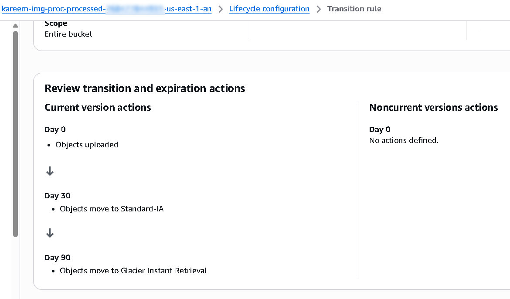

# Cost Optimization Analysis

This document details the cost engineering decisions applied throughout the Global Secure Image Processing Pipeline. The architecture is deliberately structured so that baseline cost scales with actual usage rather than provisioned capacity, and so that advanced/security tooling is an explicit, reversible cost decision rather than an implicit fixed overhead.

---

## Serverless Architecture

Every compute and orchestration component in the core pipeline — API Gateway, both Lambda functions, SQS, and DynamoDB — is a fully managed, pay-per-use service. There is no EC2 instance, container cluster, or provisioned-capacity database anywhere in the architecture. This eliminates the single largest source of avoidable cloud spend in most workloads: idle provisioned capacity that exists to absorb peak load but sits unused the majority of the time.

For a workload with an inherently unpredictable, user-driven traffic pattern — image uploads — this is not simply a cost optimization but the architecturally correct choice: there is no steady-state load to size a fixed-capacity fleet against in the first place.

---

## Event-Driven Processing

The ingestion-to-processing path is fully event-driven: an S3 `ObjectCreated` event enqueues a message, and an SQS event source mapping invokes the processing Lambda in batches. This means:

- Compute cost is incurred **only** for the milliseconds of actual image-processing execution, not for any period of waiting or polling.
- Concurrency scales automatically with queue depth, up to the explicit `reserved_concurrent_executions` ceiling — which is itself a cost control, bounding the maximum simultaneous compute spend during an unexpected traffic spike.
- There is no scheduled polling, cron-based batch job, or always-on consumer process anywhere in the pipeline.

---

## DynamoDB On-Demand

The metadata table uses `PAY_PER_REQUEST` billing mode rather than provisioned throughput. This removes the need to forecast read/write capacity units against an unpredictable upload volume, and removes the two failure modes of provisioned capacity: under-provisioning (throttling, failed writes during a traffic spike) and over-provisioning (paying for capacity that sits unused). On-demand mode's marginally higher per-request cost at sustained high volume is an accepted, deliberate trade-off against the operational and reliability cost of manual capacity planning at this workload's scale.

---

## S3 Lifecycle Policies

Both S3 buckets carry lifecycle rules tuned to their distinct roles:

- **Upload bucket:** raw, unprocessed uploads expire after 7 days (including non-current versions), reflecting the bucket's role as a transient landing zone rather than a permanent archive. This bounds storage cost growth regardless of upload volume over time.
- **Processed bucket:** finished assets transition from S3 Standard to `STANDARD_IA` at 30 days and to `GLACIER_IR` (Glacier Instant Retrieval) at 90 days. Glacier Instant Retrieval is specifically chosen over archival-tier Glacier classes because it preserves millisecond-scale retrieval latency — critical since these objects may still be served through CloudFront — while still capturing the storage-cost reduction of a colder tier for infrequently accessed older content.

---

## CloudFront Content Delivery

CloudFront is configured with `PriceClass_100`, restricting edge location usage to the lowest-cost tier (North America and Europe) rather than the full global edge footprint. This is a deliberate cost/latency trade-off appropriate for a primary user base concentrated in those regions; a broader `PriceClass_All` configuration would be revisited if traffic analytics indicated meaningful demand from Asia-Pacific or other excluded regions.

Compression is enabled on the default cache behavior, reducing data transfer volume — and therefore both cost and latency — for compressible content types without any origin-side change.

---

## Cost Optimization Benefits Summary

| Optimization | Mechanism | Effect |
|---|---|---|
| No idle compute | Lambda (both functions) | Zero cost during periods with no upload activity |
| No idle database capacity | DynamoDB on-demand | Cost scales linearly with actual read/write volume |
| Bounded ingestion storage | Upload bucket lifecycle expiration | Storage cost does not grow unbounded with cumulative upload volume |
| Tiered processed-asset storage | Lifecycle transitions to STANDARD_IA / GLACIER_IR | Reduces storage cost for aging content without sacrificing retrieval latency |
| Reduced KMS request volume | S3 Bucket Keys (`bucket_key_enabled`) | Fewer billed KMS API calls per encrypted object operation |
| Edge cost tiering | CloudFront `PriceClass_100` | Excludes highest-cost edge regions not required by the primary user base |
| Phase-gated advanced tooling | Boolean feature flags (WAF, CloudTrail, GuardDuty, Security Hub, CRR, Global Tables, Route 53 health checks) | Recurring cost for advanced security/DR posture is incurred only when deliberately activated, not by default |
| Bounded processing blast radius | `reserved_concurrent_executions` on the processing function | Caps maximum simultaneous compute spend during an unexpected traffic spike |

---

## Governance Note

Every cost-generating capability beyond the always-on core is represented as an explicit, named configuration flag defaulting to `false`. This gives any reviewer — technical or financial — a single, auditable point of truth for what is currently incurring cost in a given deployment, rather than requiring a line-by-line resource audit to determine the account's current cost exposure.
