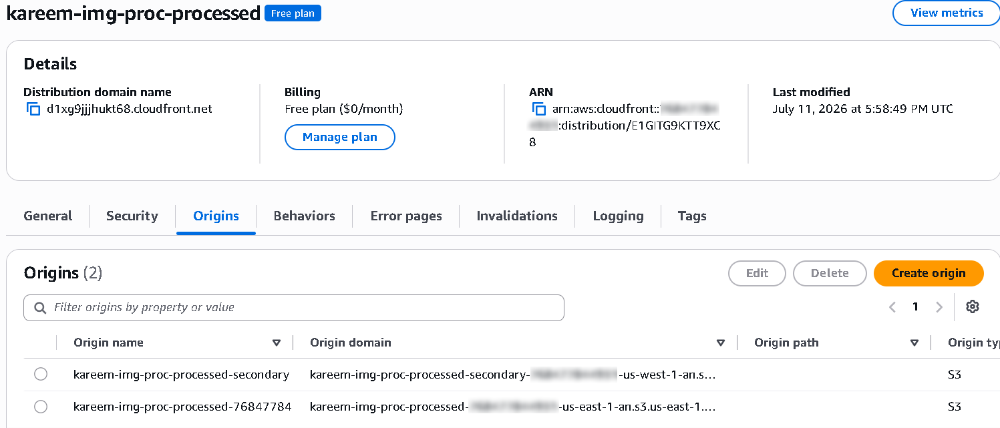

# Disaster Recovery Strategy

This document defines the disaster recovery (DR) posture of the Global Secure Image Processing Pipeline, including recovery objectives, the multi-region mechanisms available to meet them, and the operational procedures for invoking recovery.

---

## Recovery Strategy Overview

The architecture operates in a **single-region steady state** (Phase 1) with a **fully defined, flag-gated multi-region DR path** (Phase 2) that can be activated independently of the core stack. This reflects a deliberate architectural stance: DR capability is engineered and tested, but its recurring cost (duplicate storage, inter-region transfer, additional replicated capacity) is incurred only when the organization's risk tolerance and budget call for it — the same reasoning applied by mature organizations staging DR investment against actual business impact.

The DR model combines three independent mechanisms, each addressing a different data plane:

| Data Plane | DR Mechanism | Failover Behavior |
|---|---|---|
| Object storage (processed images) | S3 Cross-Region Replication (CRR) | Asynchronous, near-real-time replication to a secondary-region bucket |
| Metadata (structured records) | DynamoDB Global Tables | Active-active multi-region replication with last-writer-wins conflict resolution |
| Edge delivery/routing | CloudFront Origin Group | Automatic failover from primary to secondary origin on defined error status codes |

---

## Cross-Region Replication (S3)

When `enable_crr = true`, the processed-images bucket replicates every new object to a bucket in the secondary region (`us-west-1` by default), with the following properties:

- **Encryption-aware replication.** Because the source bucket uses SSE-KMS, the replication rule explicitly sets `source_selection_criteria.sse_kms_encrypted_objects.status = Enabled` — S3 does not replicate KMS-encrypted objects by default, and omitting this setting causes replication to silently no-op with no error surfaced.
- **Region-local re-encryption.** The destination bucket re-encrypts replicated objects using a dedicated Customer Managed Key provisioned in the secondary region, since KMS key material is region-bound and cannot be referenced cross-region.
- **Cost-tiered replica storage.** The replica is written directly to `STANDARD_IA`, reflecting its role as a DR copy rather than a primary-serving copy.
- **Independent trust boundary.** The secondary bucket has its own Block Public Access enforcement and its own CloudFront-OAC-scoped bucket policy, so the DR copy inherits the same security posture as the primary — replication does not create a weaker-secured shadow copy of the data.

---

## DynamoDB Global Tables

When `enable_global_tables = true`, a replica of the metadata table is provisioned in the secondary region via `aws_dynamodb_table_replica`, built on the DynamoDB Streams capability already enabled on the primary table. This provides:

- **Active-active availability** for metadata reads in either region.
- **Automatic conflict resolution** using DynamoDB's native last-writer-wins semantics — acceptable for this workload's access pattern (each metadata record is written once by the function that processed the corresponding image, with no concurrent multi-region writers to the same key in normal operation).
- **No application-layer replication logic** — this is a fully managed AWS capability layered onto an existing table via a single resource declaration.

---

## CloudFront Origin Group Failover

The CloudFront distribution is defined with a conditional Origin Group: when CRR is enabled, the distribution's default cache behavior targets an Origin Group containing both the primary and secondary-region processed buckets, with failover triggered by any of the following origin response codes: `403, 404, 500, 502, 503, 504`.

This means a regional outage affecting the primary bucket (or a misconfiguration producing sustained errors) causes CloudFront to automatically retry the same request against the secondary-region origin — **transparently to the client**, with no DNS change, redeploy, or manual intervention required. When CRR is disabled, the distribution falls back to a single-origin configuration targeting only the primary bucket.

---

## Data Protection

- **Versioning** is enabled unconditionally on both the upload and processed S3 buckets (a prerequisite for CRR, and independently valuable for point-in-time object recovery from accidental overwrite or deletion).
- **Lifecycle policies** on the processed bucket transition older content to lower-cost storage classes (`STANDARD_IA` at 30 days, `GLACIER_IR` at 90 days) without compromising retrievability — Glacier Instant Retrieval maintains millisecond-scale access, unlike archival-tier Glacier classes.
- **DynamoDB Point-in-Time Recovery** is available as an opt-in control (disabled by default in this portfolio deployment to minimize cost) and would be enabled unconditionally in a production adoption of this architecture.

---

## Recovery Time Objective (RTO) and Recovery Point Objective (RPO)

| Failure Scenario | RTO (Target) | RPO (Target) | Basis |
|---|---|---|---|
| Single-AZ failure within primary region | Near-zero | Near-zero | All core services (S3, Lambda, SQS, DynamoDB, API Gateway) are natively multi-AZ managed services; no single-AZ dependency exists in this architecture |
| Primary-region processed-bucket degradation (CRR active) | < 5 minutes | Near-zero (asynchronous replication lag only) | CloudFront Origin Group failover is automatic at the edge; no manual DNS or configuration change required |
| Full primary-region outage (CRR + Global Tables active) | 15–30 minutes | < 15 minutes (typical CRR/Global Tables replication lag under normal load) | Requires redirecting ingestion (API Gateway/Lambda) to the secondary region, which is a manual/scripted cutover in the current design — see Future Enhancements |
| Full primary-region outage (Phase 2 DR flags disabled) | Not recoverable within the region-outage window | Last successful replication (none, if CRR/Global Tables were never enabled) | Explicitly accepted risk at Phase 1; documented, not hidden |

> **Note:** The current architecture provides regional resilience for **data** (S3 objects, DynamoDB metadata) and **delivery** (CloudFront). It does not yet provide automatic multi-region failover for the **ingestion compute path** (API Gateway + Lambda) — a full regional outage still requires either a manual redeployment targeting the secondary region as primary, or a pre-provisioned standby ingestion stack (a documented future enhancement, not yet implemented).

---

## Recovery Procedures

1. **Detect.** Route 53 health check failure (when enabled) or CloudWatch alarm/GuardDuty finding signals a regional degradation; SNS notifies operators.
2. **Verify scope.** Confirm via the AWS Health Dashboard and CloudTrail/CloudWatch whether the disruption is regional (AWS-side) or application-side (a bad deployment, a misconfiguration).
3. **Confirm data-plane failover.** For a regional disruption with CRR/Global Tables active, verify CloudFront is serving from the secondary origin (visible in CloudFront's real-time logs / origin metrics) and that DynamoDB reads/writes are succeeding against the secondary-region replica.
4. **Cut over ingestion (if required).** If the primary region's API Gateway/Lambda ingestion path is unavailable, redeploy the ingestion stack against the secondary region with the primary/secondary roles swapped, pointing at the already-replicated S3/DynamoDB resources.
5. **Validate.** Run the smoke test (`infrastructure/scripts/test_upload.py`) against the recovered endpoint to confirm end-to-end functionality before declaring recovery complete.
6. **Fail back.** Once the primary region is confirmed healthy, reverse the cutover in a controlled maintenance window, allowing CRR/Global Tables replication to re-synchronize before resuming primary-region ingestion.

---

## Failure Scenarios

| Scenario | Impact Without Phase 2 DR | Impact With Phase 2 DR Active |
|---|---|---|
| Accidental object deletion in processed bucket | Recoverable via S3 Versioning (previous version restorable) | Same, plus a redundant copy exists in the secondary-region bucket |
| Accidental DynamoDB item overwrite | Not recoverable unless Point-in-Time Recovery is separately enabled | Same — Global Tables replicate the overwrite, they do not protect against logical/application-level data corruption |
| KMS key accidental deletion | 7-day mandatory waiting window allows cancellation; after that, data encrypted under that key is permanently unrecoverable | Same per-region; the secondary-region CMK is an entirely independent key with its own lifecycle |
| Regional AWS service disruption (S3/DynamoDB/CloudFront) | Full service outage for the duration of the AWS-side event | Data and delivery continue to serve from the secondary region; ingestion cutover may still require manual action |
| Malicious deletion via a compromised IAM principal | Bounded by least-privilege scoping (no role has broad delete permissions) and CloudTrail-based forensic reconstruction | Same, with an additional recovery source in the secondary region |

DynamoDB Global Tables replication does **not** protect against logical errors (an application bug that writes incorrect data) — replication faithfully propagates the error to all regions. Logical-error protection requires Point-in-Time Recovery or application-level validation, not multi-region replication.
