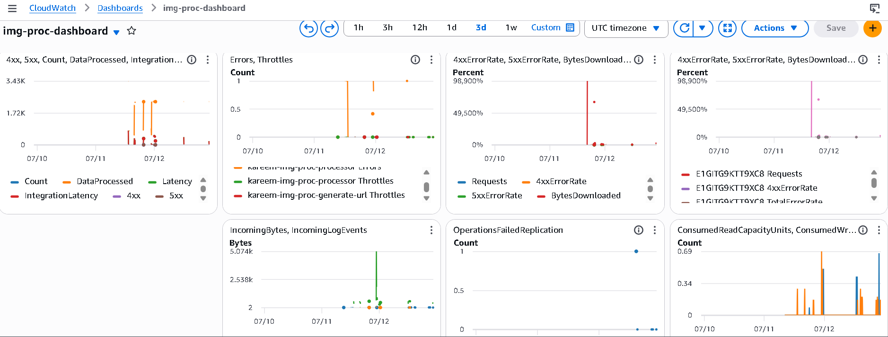
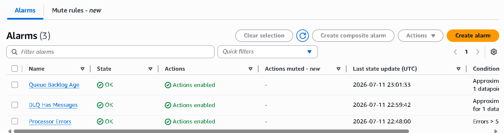
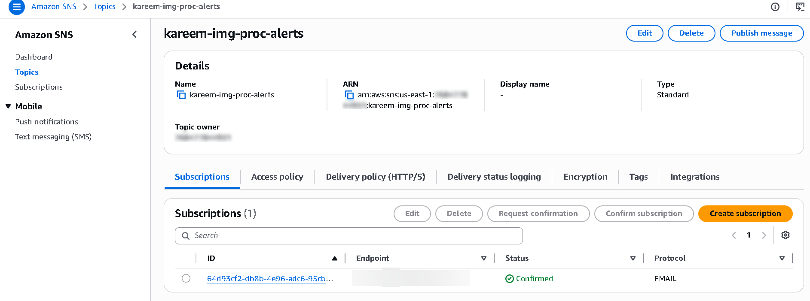
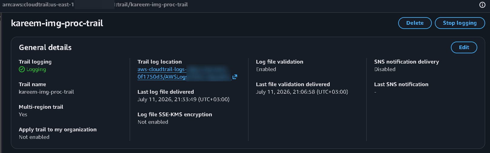
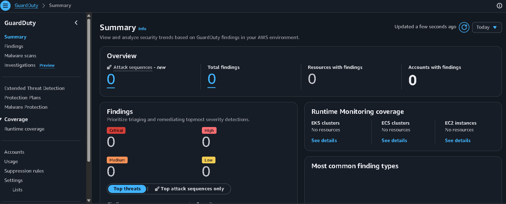
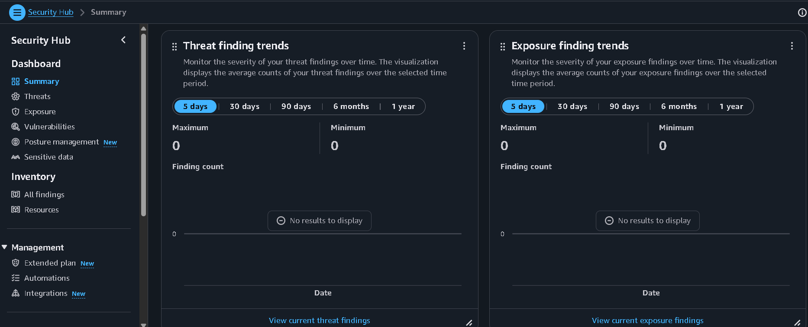

# Monitoring and Observability

This document describes the operational and security monitoring stack for the Global Secure Image Processing Pipeline.

---

## CloudWatch

Amazon CloudWatch is the central telemetry backbone for the architecture, providing metrics, logs, and alarm evaluation across every compute and messaging component.

### Logs

| Log Group | Source | Retention |
|---|---|---|
| `/aws/lambda/<project>-generate-url` | `GenerateUploadURL` Lambda | Configurable, bounded (default 7 days) |
| `/aws/lambda/<project>-processor` | `ImageProcessor` Lambda | Configurable, bounded (default 7 days) |
| CloudFront access/real-time logs | CloudFront distribution | Optional, not enabled by default in the portfolio deployment |
| WAF sampled request logs | AWS WAF (Phase 2) | Retained per AWS WAF's default sampling window |

Bounded retention is a deliberate cost control — logs are retained long enough to support operational troubleshooting and short-window forensic review, without accumulating unbounded storage cost over the life of the deployment.

### Metrics

| Metric | Namespace | Purpose |
|---|---|---|
| `Errors` | `AWS/Lambda` | Tracks unhandled exceptions in either function |
| `Duration` | `AWS/Lambda` | Supports performance-tuning and timeout-sizing decisions |
| `ConcurrentExecutions` | `AWS/Lambda` | Validates the processing function is operating within its `reserved_concurrent_executions` ceiling |
| `ApproximateAgeOfOldestMessage` | `AWS/SQS` | Detects a processing backlog forming on the main queue |
| `ApproximateNumberOfMessagesVisible` | `AWS/SQS` | Tracks both main-queue depth and DLQ accumulation |

### Dashboards

A CloudWatch dashboard consolidates the above metrics into a single operational view, allowing an on-call engineer to assess pipeline health (throughput, error rate, queue depth, DLQ accumulation) without navigating multiple console pages.

### Alarms

| Alarm | Condition | Action |
|---|---|---|
| `<project>-processor-errors` | `Errors` sum > 5 within a 5-minute period | Publish to SNS `<project>-alerts` |
| `<project>-queue-backlog-age` | `ApproximateAgeOfOldestMessage` > 300 seconds (max, over 2 periods) | Publish to SNS `<project>-alerts` |
| `<project>-dlq-has-messages` | `ApproximateNumberOfMessagesVisible` (DLQ) ≥ 1 | Publish to SNS `<project>-alerts` |

---

## SNS Notifications

An SNS topic (`<project>-alerts`) is the single fan-out point for all CloudWatch alarm state transitions. An email subscription is provisioned conditionally (only when an alert email address is supplied), demonstrating the pattern for adding additional subscriber types (SMS, a chat-ops webhook via Lambda, a ticketing-system integration) without modifying the alarm definitions themselves.

---

## Security Monitoring

Security-relevant monitoring is layered on top of, and shares the same alerting substrate as, operational monitoring:

- **AWS CloudTrail** provides the authoritative, tamper-evident record of all control-plane API activity across the account, with multi-region coverage and log file validation enabled.
- **Amazon GuardDuty** continuously analyzes account activity for behavioral indicators of compromise, independent of any explicit alarm configuration — findings surface directly in the GuardDuty console and are exportable to EventBridge for future automation.
- **AWS Security Hub** aggregates findings (including GuardDuty's) against the AWS Foundational Security Best Practices standard, providing a single posture score rather than requiring per-service review.
- **AWS WAF sampled request logs** provide near-real-time visibility into blocked malicious traffic at the edge, supporting both security monitoring and rule-tuning decisions.

---

## Operational Monitoring

| Concern | Signal | Response Path |
|---|---|---|
| Processing function regression | Lambda `Errors` alarm | Investigate CloudWatch Logs for the affected invocation(s); check for a recent code or dependency change |
| Processing capacity exhaustion / stall | SQS queue backlog age alarm | Check for a stuck or throttled Lambda execution; verify `reserved_concurrent_executions` has not been exhausted |
| Systematic processing failure | DLQ depth alarm | Inspect DLQ message bodies for a common failure pattern; redrive once root cause is resolved |
| Replication health (Phase 2) | S3 CRR replication status, DynamoDB Global Tables replica lag | Reviewed via console/CLI during DR validation windows; not currently wired into an automated alarm |

---

## Current Gaps (tracked in `assumptions-and-limitations.md`)

- CloudFront access logging and real-time logs are not enabled by default in the portfolio deployment (cost/log-volume trade-off) — a production adoption should enable at least sampled real-time logs.
- GuardDuty and Security Hub findings are not yet routed into an automated EventBridge-driven response workflow; they are reviewed manually.
- No composite/anomaly-detection alarms are currently defined; all alarms use static thresholds.
