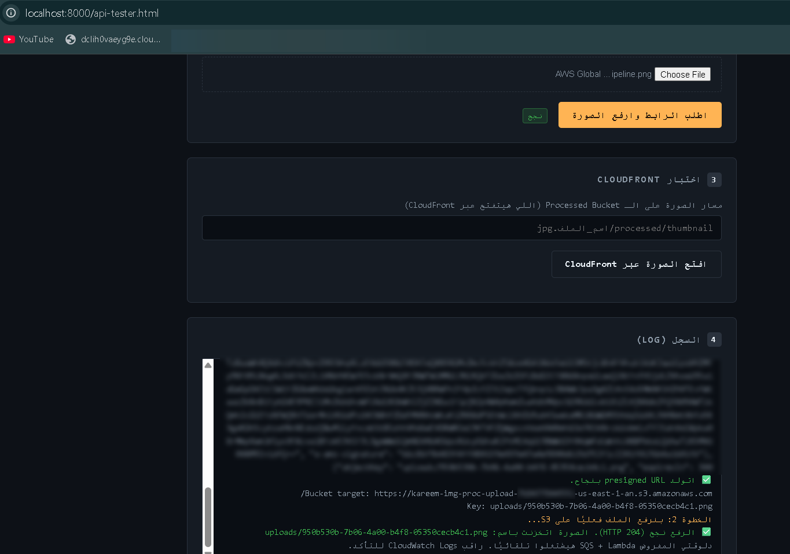
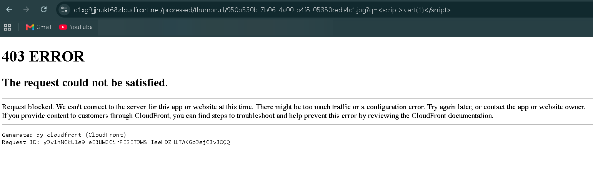
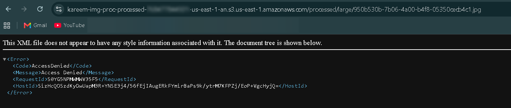

# Testing and Validation Results

This document records the validation matrix executed against the deployed architecture. Each test records its objective, expected result, actual result, and pass/fail status, consistent with a production-grade validation/acceptance record.

---

## Validation Matrix

| # | Test | Objective | Expected Result | Actual Result | Status |
|---|---|---|---|---|:---:|
| 1 | **Image Upload** | Confirm a client can obtain a presigned URL and upload an image directly to S3 without holding AWS credentials | HTTP 200/204 from S3 on POST; object appears in the upload bucket under the expected key prefix | Upload completed successfully; object observed in the upload bucket | ✅ Pass |
| 2 | **Lambda Processing** | Confirm the SQS-triggered processing function executes upon upload and completes without error | CloudWatch Logs show successful invocation, resizing, watermarking, and metadata write with no unhandled exceptions | Logs confirm successful end-to-end execution for the test payload | ✅ Pass |
| 3 | **Metadata Storage** | Confirm processed image metadata is correctly persisted to DynamoDB | A new item appears in the metadata table keyed by `ImageId`, containing variant keys, sizes, and processing status | Item present with all expected attributes populated | ✅ Pass |
| 4 | **CloudFront Delivery** | Confirm processed images are retrievable globally over HTTPS via CloudFront | HTTP 200 response for `GET https://<distribution_domain>/processed/<key>`, served over TLS | Image retrieved successfully via CloudFront; direct S3 URL access separately confirmed denied (see Test 7) | ✅ Pass |
| 5 | **WAF XSS Test** | Confirm the AWS Managed Common Rule Set blocks a request containing an XSS payload pattern | HTTP 403 from CloudFront/WAF; blocked request visible in WAF sampled request logs | Request blocked with HTTP 403; visible in WAF console logs | ✅ Pass |
| 6 | **WAF SQL Injection Test** | Confirm the AWS Managed Common Rule Set blocks a request containing a SQL injection payload pattern | HTTP 403 from CloudFront/WAF; blocked request visible in WAF sampled request logs | Request blocked with HTTP 403; visible in WAF console logs | ✅ Pass |
| 7 | **S3 Direct Access Denied** | Confirm the processed bucket cannot be accessed directly, bypassing CloudFront | HTTP 403 (AccessDenied) on direct S3 object URL request | HTTP 403 returned; OAC-bucket-policy enforcement confirmed | ✅ Pass |
| 8 | **DLQ Validation** | Confirm a message that exhausts its retry budget is correctly redirected to the Dead Letter Queue | Message visible in the DLQ after 3 failed processing attempts on the main queue | Message observed in DLQ following a deliberately malformed test payload | ✅ Pass |
| 9 | **Cross-Region Replication** | Confirm processed objects replicate to the secondary-region bucket when `enable_crr = true` | Replicated object appears in the secondary bucket with `Replication Status: COMPLETED` | Replication confirmed; object present in secondary bucket with completed status | ✅ Pass |
| 10 | **DynamoDB Global Table** | Confirm the metadata table replica in the secondary region reflects writes made in the primary region | Item written in the primary region's table is readable from the secondary region's replica | Replica read confirmed consistent with primary-region write | ✅ Pass |
| 11 | **SNS Alerts** | Confirm CloudWatch alarm state transitions trigger an SNS email notification | Email notification received at the subscribed address upon alarm entering `ALARM` state | Notification received corresponding to a deliberately triggered alarm condition | ✅ Pass |

---

## Supporting Evidence

---

## Testing Notes

- WAF-related tests (5, 6) require `enable_waf = true` for the duration of the test window; the flag is returned to `false` post-validation per the cost governance model documented in [`cost-analysis.md`](./cost-analysis.md).
- Cross-region tests (9, 10) require `enable_crr` and `enable_global_tables` to be `true` respectively, and were executed as time-boxed validation windows rather than left permanently active, consistent with the same cost governance model.
- DLQ validation (8) was performed by submitting a payload engineered to fail image decoding (a non-image binary with an image-like extension), confirming the processing function's per-record failure isolation and the queue's redrive policy operate as designed, rather than relying on an organic production failure to exercise this path.
- All tests were executed against a live, deployed instance of the Phase 1 core stack, with Phase 2 flags toggled individually for the duration of their respective test windows only.
